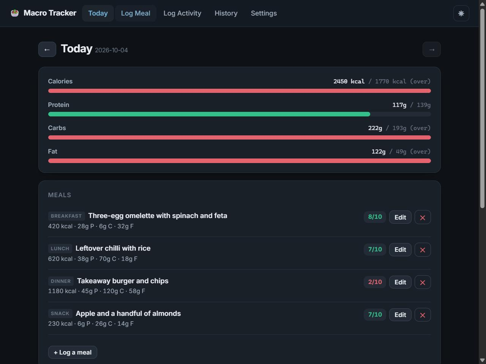
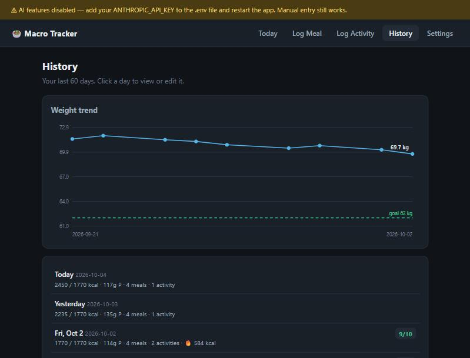

# Macro Tracker

A calorie and macro tracker where you describe what you ate in plain English and
Claude works out the macros, scores the meal against your goal, and rates your day.

Most trackers make you search a food database and pick a portion size from a
dropdown. This one takes `"a grilled chicken wrap with mayo and a can of coke"`
and returns a per-item breakdown, a 1–10 score against your actual targets, and
two or three specific things to change next time. When the description is too
vague to estimate — `"pizza"` — it asks one question instead of inventing a number.

<p align="center">
  
  
</p>

---

## Stack

| Layer | Choice | Why |
| --- | --- | --- |
| **Language** | Python 3.11+ | |
| **API** | [FastAPI](https://fastapi.tiangolo.com/) | Pydantic validation and an OpenAPI schema come free with the route definitions |
| **Validation** | [Pydantic v2](https://docs.pydantic.dev/) | Request models and domain rules share one validation layer |
| **Server** | [Uvicorn](https://www.uvicorn.org/) | ASGI, with `--reload` for development |
| **Database** | SQLite (stdlib `sqlite3`), WAL mode | Single-user app; a file beats a service, and no ORM is needed for five tables |
| **AI** | [Anthropic SDK](https://github.com/anthropics/anthropic-sdk-python) by default, or any OpenAI-compatible endpoint | Forced tool calls make every response structured, so the app never parses prose. One adapter covers Groq, Gemini, OpenRouter and Ollama |
| **Frontend** | Vanilla JS, hash router, CSS custom properties | No build step — clone and run. ~1,200 lines, no framework, no `node_modules` |
| **Charts** | Hand-written inline SVG | One chart; a charting library would be larger than the app's own frontend |
| **Tests** | pytest + `fastapi.testclient` | 345 tests, no network calls |
| **Evals** | Custom harness (`evals/`) | Measures the three Claude flows against reference values |
| **Lint** | [Ruff](https://docs.astral.sh/ruff/) | |
| **CI** | GitHub Actions | Lint, tests, and an offline eval run on every push |

There is deliberately no Node toolchain, no ORM, no migration framework and no
CSS framework. The whole app is Python plus three static files.

---

## Features

**Targets.** Onboarding collects age, sex, height, weight, activity level and
goal, then computes BMR with [Mifflin–St Jeor](https://pubmed.ncbi.nlm.nih.gov/2305711/),
scales it by activity level to a TDEE, and applies a goal adjustment. Protein is
set per kilogram of bodyweight, fat at 25% of calories, carbs fill the remainder.
A cut is never prescribed below BMR or below 1,200 kcal.

**Meal logging.** Describe a meal; the model returns a per-item macro breakdown,
a score against your targets, and concrete suggestions. You review and can edit
every number before it is saved. Manual entry works with no API key at all.

**Workout logging.** Free text (`"bench 4x8 at 60kg then 20 min treadmill"`) is
parsed into structured exercises with a MET-based calorie estimate. Step counts
are costed from bodyweight.

**Day rating.** Rates the whole day 1–10 on target adherence, food quality and
activity, plus a progress note that reads your recent weight trend against your
goal and timeline.

**History.** A 60-day weight trend chart with your goal line, and a per-day list
you can click into to view or edit any past day.

**Weight tracking.** Logging a new weight recomputes your targets automatically,
since a 70 kg person and a 62 kg person do not have the same maintenance calories.

**Bring your own model.** Runs on Anthropic, on a free hosted tier (Groq, Google
Gemini, OpenRouter), or fully offline on a local [Ollama](https://ollama.com)
model — one `.env` setting, no code change.

**Graceful without a model.** With nothing configured, targets, manual logging,
history and the charts all still work; a banner says exactly what is missing.

---

## Results

The three model-backed flows are measured against a 23-case eval set with
hand-computed reference values. A real run of `llama3.1:8b`, local on CPU:

| Flow | Metric | Score |
| --- | --- | --- |
| Day rating | within 2 points of reference | **100%** |
| Meal analysis | calories within 25% | **67%** |
| Meal analysis | macro split reconstructs the total | **100%** |
| Meal analysis | returned a named per-item breakdown | **100%** |
| Workout parsing | burn within 40% of a MET reference | **20%** |

The honest read: good enough for food logging if you glance at the numbers
before saving, not good enough to trust for exercise burn. Day ratings are
genuinely strong — the model correctly flagged an under-eating day as a problem
rather than rewarding the large deficit.

Getting there needed a real fix. Local models call the right tool and then leave
the nested `items` array empty — 0/2 and 0/3 on two models, identical on
Ollama's native and OpenAI-compatible endpoints, so it was the models rather
than the adapter. Swapping tool calling for a `response_format` JSON schema took
the end-to-end smoke test from 0/3 to 3/3: **a tool schema is advisory, a
response-format schema constrains generation.**

Method, per-case numbers and the full comparison table are in
[evals/RESULTS.md](evals/RESULTS.md).

---

## Running it

```bash
git clone https://github.com/<your-github-username>/macro-tracker.git
cd macro-tracker
python -m venv .venv && .venv/bin/activate     # Windows: .venv\Scripts\activate
pip install -r requirements.txt
python scripts/seed_demo.py                     # optional: two weeks of demo data
python -m uvicorn app.main:app --reload
```

Then open <http://127.0.0.1:8000>.

On Windows, `run.bat` does the venv, install and launch in one step.

### Enabling the AI features

The app runs without any model configured — targets, manual logging, history and
charts all work, and a banner says why the AI is off. `GET /api/health` reports
the active provider, or the reason it is unavailable.

```bash
cp .env.example .env
```

Then pick **one** provider and restart.

**Anthropic** (default, paid, best quality). Roughly $0.005 per meal analysis on
Sonnet, half that on Haiku — logging a meal a day for a year costs about $2.

```ini
ANTHROPIC_API_KEY=sk-ant-...
```

**A free hosted provider.** Groq, Google Gemini and OpenRouter all have free
tiers and all speak the OpenAI chat-completions dialect, which the app
translates to:

```ini
MACRO_TRACKER_PROVIDER=groq      # or gemini, openrouter
MACRO_TRACKER_MODEL=<model id>
GROQ_API_KEY=...
```

**Fully local, via [Ollama](https://ollama.com).** Free forever and fully
offline, no key needed:

```ini
MACRO_TRACKER_PROVIDER=ollama
MACRO_TRACKER_MODEL=<name from `ollama list`>
```

This path automatically switches to **schema-constrained output** instead of
tool calling, because local models reliably call the right tool and then leave
the nested `items` array empty. See [evals/RESULTS.md](evals/RESULTS.md) for the
measurements behind that, and for how `llama3.1:8b` actually scores.

Model ids are deliberately **not** defaulted for the non-Anthropic providers.
Catalogues churn, and a hardcoded id that silently 404s a year from now is worse
than an error telling you to go pick one — so a missing `MACRO_TRACKER_MODEL`
fails with a link to that provider's model list.

A note on quality: smaller free models are noticeably worse at portion
estimation. Measured on this repo's own eval set, `llama3.1:8b` running locally
scores **100% on day ratings, 67% on meal calories and 20% on workout calorie
estimates** — good enough to be useful for food logging, not good enough to
trust for exercise burn. Full numbers and method in
[evals/RESULTS.md](evals/RESULTS.md).

### Configuration

| Variable | Default | Purpose |
| --- | --- | --- |
| `MACRO_TRACKER_PROVIDER` | `anthropic` | `anthropic`, `groq`, `gemini`, `openrouter`, `ollama`, or `openai` for any other compatible endpoint |
| `MACRO_TRACKER_MODEL` | `claude-sonnet-5` on Anthropic, else required | Must support forced tool choice, or the adapter falls back to an unforced one |
| `ANTHROPIC_API_KEY` | *(unset)* | For the default provider |
| `GROQ_API_KEY` / `GEMINI_API_KEY` / `OPENROUTER_API_KEY` | *(unset)* | For the matching preset |
| `MACRO_TRACKER_BASE_URL` | *(from the preset)* | Override, or required for `openai` |
| `MACRO_TRACKER_STRUCTURED_OUTPUT` | on for `ollama`, off elsewhere | Force schema-constrained output instead of tool calling |
| `MACRO_TRACKER_DB` | `./macro_tracker.db` | SQLite file location |

---

## Architecture

```
app/
  main.py          FastAPI app, static mount, exception handlers
  db.py            Schema, connection lifecycle, pragmas
  models.py        Pydantic request models
  validation.py    Shared validators and domain limits
  targets.py       BMR / TDEE / macro split (pure functions, no I/O)
  ai.py            Tool definitions, prompts, and output validation
  providers.py     Anthropic + OpenAI-compatible adapters
  routers/         profile, meals, activities, days
static/            index.html + CSS + vanilla-JS views (no build step)
tests/             345 pytest tests
evals/             Eval harness for the three Claude flows
scripts/           seed_demo.py
```

### How the model integration works

All three AI flows use the same shape: a **forced tool call whose schema is the
response contract**. The model never returns prose for the app to parse. It
either calls `ask_clarification` to get a missing portion size, or it calls the
submit tool with structured macros.

```python
result = ai.call_with_meta(
    meal_system_prompt(profile, meal_type),
    conversation,
    [ASK_CLARIFICATION_TOOL, SUBMIT_MEAL_TOOL],
    {"type": "any"},  # must call one of them
)
```

The user's profile and current targets are injected into every system prompt, so
the same meal scores differently for someone cutting than for someone bulking.

**A tool schema constrains shape, not sanity.** A model can return a
schema-valid 3,000 g of protein or a score of 47. Every tool call therefore goes
through `ai.validate_*` before a router sees it, and meal totals are always
recomputed from the per-item breakdown rather than trusted — the breakdown is
what the user reviews, so the saved totals have to be the ones that add up to
it. This matters *more* on a weaker free model, not less.

### The provider adapter

Because everything downstream of the call works on a plain dict, swapping
providers is an adapter rather than a rewrite. `app/providers.py` translates
three things:

| | Anthropic | OpenAI-compatible |
| --- | --- | --- |
| Tool definition | `{name, description, input_schema}` | `{type: "function", function: {…, parameters}}` |
| Force a call | `tool_choice={"type": "any"}` | `tool_choice="required"` |
| Arguments arrive as | a `dict` | a JSON **string** |

**Structured-output mode.** For providers whose tool calling is too weak, the
adapter swaps `tools` for `response_format: {"type": "json_schema", ...}`. A
tool schema is *advisory* — the model is offered one and may ignore parts of it.
A response-format schema *constrains generation*. On local models that
distinction took this app from 0/3 to 3/3; the measurements are in
[evals/RESULTS.md](evals/RESULTS.md). The cost is that one schema means no
choice of tool, so the model always commits to an analysis instead of asking a
clarifying question — a trade-off the eval set quantifies rather than hides.

Three more things the adapter handles that are easy to miss:

- **Forced tool choice is not universal.** Anthropic's Opus 5.5, Sonnet 5.5 and
  Fable 5.1 reject it with a 400, and some OpenAI-compatible endpoints do not
  implement `required`. The adapter retries once with an unforced choice, then
  remembers, so the fallback is not re-paid on every later call.
- **JSON arguments can be malformed.** A weaker model can emit invalid JSON in a
  tool call, which the Anthropic path structurally cannot. That is caught and
  surfaced as a retryable error rather than a crash.
- **Errors are made actionable.** A wrong model id names the provider's model
  list; a connection failure to Ollama asks whether `ollama serve` is running.

---

## Validation

Validation lives in two layers, because the two sources of bad data fail
differently.

**Request bodies** go through Pydantic models in `app/models.py`, built on shared
annotated types in `app/validation.py`:

- Dates must be a real `YYYY-MM-DD` calendar date. `date.fromisoformat` alone is
  too permissive — it accepts `20260115`, which would be stored and then never
  match `2026-01-15` again, since every query compares date strings lexically.
- A date you log *against* cannot be in the future (with one day of timezone
  slack). A date used as a *query bound* can be, because asking for "this month"
  before the month is over is normal.
- Per-entry ceilings: 20,000 kcal per meal, 2,000 g per macro, 200,000 steps.
- Cross-field rules: a rest day cannot burn calories, a steps entry needs a step
  count, and a "lose fat" goal cannot have a target weight above your current one.
- Partial updates use `exclude_unset`, so `{"timeline_weeks": null}` clears the
  field instead of being silently ignored.

**Claude's tool output** goes through `ai.validate_meal_analysis`,
`validate_activity_analysis` and `validate_day_rating`. An unusable response
becomes a 503 the user can retry, never a bad row. Recoverable noise is handled
rather than fatal: an unparseable `sets` count on one exercise is dropped, not
grounds for discarding the whole analysis.

---

## Tests

```bash
pip install -r requirements-dev.txt
pytest -q
```

345 tests, no network calls, ~15 seconds.

| File | Covers |
| --- | --- |
| `test_targets.py` | BMR/TDEE against hand-computed reference values, macro reconciliation, the BMR and 1,200 kcal floors |
| `test_validation.py` | Date parsing, range checks, goal consistency, every model's accept/reject behaviour |
| `test_api.py` | Every endpoint: status codes, persistence, day-summary arithmetic, partial updates |
| `test_ai.py` | The model boundary with the provider stubbed — malformed, out-of-range and hostile tool output |
| `test_providers.py` | Both adapters against fake clients, asserting the exact payload sent on the wire |
| `test_db.py` | Connection lifecycle and concurrent access |
| `test_graders.py` | The eval graders, driven in both directions |

Two of these exist because of bugs found while building:

- **`test_db.py`** covers a `sqlite3.ProgrammingError` that made `/api/weight`
  and `/api/days` 500 intermittently. FastAPI runs sync endpoints in a worker
  threadpool and does not guarantee a dependency's setup, the endpoint body and
  its teardown land on the same thread, which trips SQLite's default
  `check_same_thread`. The test hammers the API from a dozen threads at once.
- **`test_graders.py`** exists because the offline eval run scores 100% against
  the bundled fixtures, and a grader that returned `1.0` unconditionally would
  look identical. These tests prove each grader fails what it should.

---

## Evals

Unit tests pin down what the app does with a given model response. They cannot
tell you whether the model's *estimates are any good* — that needs a dataset with
reference values.

`evals/cases.jsonl` holds 23 labelled cases across the three flows: 12 meals
(clear, ambiguous, multi-turn, near-zero, calorie-dense), 6 workouts, and 5 full
days spanning the rating scale. Each carries a hand-computed reference value and
a note explaining where it came from.

```bash
python -m evals.run_evals --offline          # free: graders + harness only
python -m evals.run_evals                    # live, against whatever .env configures
python -m evals.run_evals --flow meal_macros --reps 3

# compare a free model against the paid default on the same cases
python -m evals.run_evals --variant baseline
python -m evals.run_evals --provider groq --model <id> --variant v1
```

That last pair is the point of the harness: run both, compare the headline
numbers, and decide whether the free model is good enough for *your* tolerance —
with data rather than vibes.

### What is measured

| Flow | Headline metric | Also tracked |
| --- | --- | --- |
| `meal_macros` | Calories within 25% of reference | Asked for clarification exactly when warranted, protein within 35%, macro split reconstructs the calorie total, returned a named per-item breakdown |
| `activity_parse` | Burn within 40% of the MET-based reference | Every expected exercise appears, clarification correctness |
| `day_rating` | Rating within 2 points of reference | Returned a progress note |

Tolerances are wide **on purpose**. Two dietitians shown "a grilled chicken wrap"
will not agree within 10%, and published MET values for "moderate resistance
training" span roughly a factor of two. A tolerance tighter than the task's own
noise floor reports sampling noise as regression.

Three design choices worth calling out:

- **Clarification is scored in both directions.** Inventing a number for
  `"pizza"` and interrogating a fully specified meal are both failures, so the
  dataset carries both ambiguous and clear cases.
- **Numeric metrics are left unscored on a question**, not zeroed — otherwise
  "correctly asked for clarification" would be indistinguishable from "got the
  calories wrong".
- **Macro coherence needs no ground truth.** Checking that
  `protein×4 + carbs×4 + fat×9` reconstructs the stated calorie total catches a
  whole class of arithmetic incoherence that a reference-value check misses.

### Offline mode

`--offline` replays hand-written stand-in responses from `evals/fixtures/`
instead of calling the API. It proves the harness, the graders and the output
contract work. It tells you **nothing about the model**, because the fixtures
were written by hand rather than recorded from a real run. CI runs this so a
broken grader fails the build without the repo needing a billed API key.

### Output

Results land in `evals/results/<flow>/<variant>/` as `results.jsonl` (one row per
case per rep, with grades, latency, token usage and the served model),
`traces/` (the full exchange per case) and `errors.jsonl` (attempts that never
produced a scorable output). Rows are written as each case finishes and a rerun
skips completed `(case, rep)` pairs, so an interrupted live run resumes instead
of re-billing.

The runner has a per-case wall-clock ceiling, jittered backoff on rate limits,
and asserts the served model matches the requested one — a silent provider
substitution would invalidate the comparison the eval exists for.

---

## API

Interactive docs at <http://127.0.0.1:8000/docs> while the app is running.

| Method | Path | |
| --- | --- | --- |
| `GET` | `/api/health` | DB status and whether an API key is configured |
| `GET POST PUT` | `/api/profile` | Read, create and update the profile; targets recompute on write |
| `GET POST` | `/api/weight` | Weight history; a new entry recomputes targets |
| `POST` | `/api/meals/analyze` | Claude meal analysis — returns a question or an analysis |
| `GET POST` | `/api/meals` | List by date, create |
| `PUT DELETE` | `/api/meals/{id}` | Update, delete |
| `POST` | `/api/activities/analyze` | Claude workout parsing |
| `GET POST` | `/api/activities` | List by date, create |
| `PUT DELETE` | `/api/activities/{id}` | Update, delete |
| `GET` | `/api/days/{date}/summary` | Totals, targets, meals, activities, rating, weight |
| `POST` | `/api/days/{date}/rate` | Claude day rating |
| `GET` | `/api/days?start=&end=` | Per-day summaries over a range |

---

## Deploying

The app is a single process with a SQLite file, so anything that runs a container
works:

```bash
docker build -t macro-tracker .
docker run -p 8000:8000 -v macro-data:/data \
  -e MACRO_TRACKER_DB=/data/macro_tracker.db \
  -e ANTHROPIC_API_KEY=sk-ant-... macro-tracker
```

Mount a volume at `/data` — SQLite on a container's ephemeral filesystem loses
every log on redeploy.

There is **no authentication**. This is a single-user app that assumes it is
reachable only by you. Do not put it on a public URL with a real API key behind
it without adding auth first.

---

## License

MIT — see [LICENSE](LICENSE).
